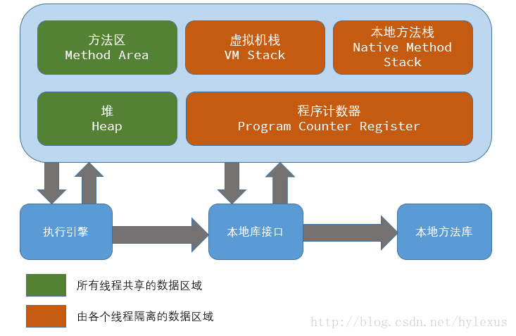
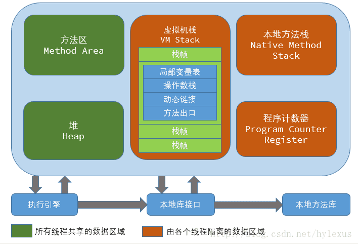
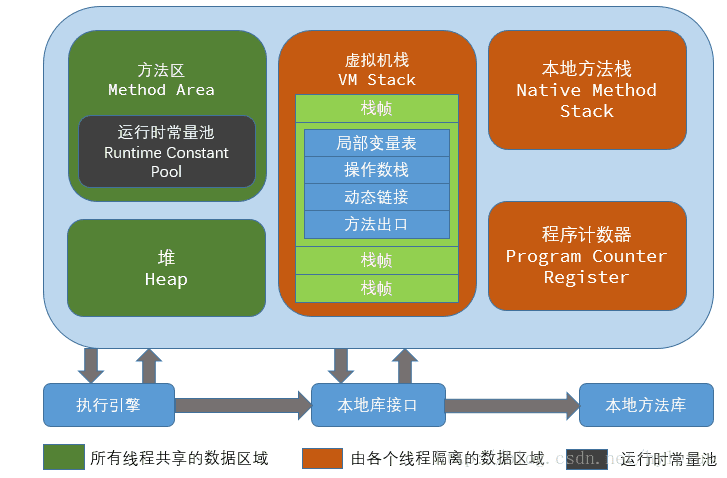

<h1 align="center">内存模型、管理及GC</h1>

[toc]

## 一、Java对象生命周期

> 对象的整个生命周期大致可以分为7个阶段：创建阶段（Creation）、应用阶段（Using）、不可视阶段（Invisible）、不可到达阶段（Unreachable）、可收集阶段（Collected）、终结阶段（Finalized）与释放阶段（Free）。

### 1. 七个阶段

#### 1.1 创建阶段(Created)：

- 为对象分配存储空间
- 开始构造对象
- 从超类到子类对static成员进行初始化
- 超类成员变量按顺序初始化，递归调用超类的构造方法
- 子类成员变量按顺序初始化，子类构造方法调用

一旦对象被创建，并被分派给某些变量赋值，这个对象的状态就切换到了应用阶段

#### 1.2 应用阶段(In Use)：

对象至少被一个强引用持有着。

#### 1.3 不可见阶段(Invisible)：

当一个对象处于不可见阶段时，说明程序本身不再持有该对象的任何强引用，虽然该这些引用仍然是存在着的。简单说就是程序的执行已经超出了该对象的作用域了。

#### 1.4 不可达阶段(Unreachable)：

对象处于不可达阶段是指该对象不再被任何强引用所持有。与“不可见阶段”相比，“不可见阶段”是指程序不再持有该对象的任何强引用。对象如果在之前的任何状态被JVM等系统下的某些已装载的静态变量或线程或JNI等强引用持有着，这些特殊的强引用被称为”GC root”。存在着这些GC root会导致对象的内存泄露情况，无法被回收，则对方也无法到达“不可达阶段”。

#### 1.5 收集阶段(Collected)

当垃圾回收器发现该对象已经处于“不可达阶段”并且垃圾回收器已经对该对象的内存空间重新分配做好准备时，则对象进入了“收集阶段”。如果该对象已经重写了finalize()方法，则会去执行该方法的终端操作。

这里要特别说明一下：不要重载finazlie()方法！原因有两点： 

- 会影响JVM的对象分配与回收速度

在分配该对象时，JVM需要在垃圾回收器上注册该对象，以便在回收时能够执行该重载方法；在该方法的执行时需要消耗CPU时间且在执行完该方法后才会重新执行回收操作，即至少需要垃圾回收器对该对象执行两次GC。 

- 可能造成该对象的再次“复活”

在finalize()方法中，如果有其它的强引用再次持有该对象，则会导致对象的状态由“收集阶段”又重新变为“应用阶段”。这个已经破坏了Java对象的生命周期进程，且“复活”的对象不利用后续的代码管理。

#### 1.6 终结阶段(Finalized)： 

当对象执行完finalize()方法后仍然处于不可达状态时，则该对象进入终结阶段。在该阶段是等待垃圾回收器对该对象空间进行回收。

#### 1.7 对象空间重分配阶段(De-allocated)：

垃圾回收器对该对象的所占用的内存空间进行回收或者再分配了，则该对象彻底消失了，称之为“对象空间重新分配阶段”。

### 2. 对象的创建

#### 2.1 创建对象的流程

  在程序员看来创建对象大部分情况下就是一个 new 关键字，而在虚拟机中远远不止这么简单。它至少包括如下几个阶段：

- 加载该对象所在的类文件（就是编译后的.class 文件）进入内存
- 在堆上分配一块跟类对象大小一样的内存
- 将对象所在的内存值初始化为 0
- 初始化对象头，包括：对象的哈希码、对象的GC分代年龄等信息
- 调用类的 init 函数进行 Java 层面的对象初始化

  流程图如下：


#### 2.2 分配对象内存的方式

  都知道 Java 生成对象需要分配内存，虚拟机又是怎样从内存池中分配一块内存给新创建的对象呢？虚拟机的实现中主要有以下两种方法：

- 指针碰撞法

> 如果 Java 堆中的内存是绝对规整的，所有用过的内存都放在一边，空闲的内存放在另一边，中间放着一个指针作为分界点的指示器，那所分配内存就仅仅是把那个指针向空闲空间那边挪动一段与对象大小相等的距离，这种分配方式称为“指针碰撞”(Bump the Pointer)。


- 空闲列表法：

> 如果 Java 堆中的内存并不是规整的，已使用的内存和空闲的内存相互交错，那就没有办法简单地进行指针碰撞了，虚拟机就必须维护一个列表，记录上哪些内存块是可用的，在分配的时候从列表中找到一块足够大的空间划分给对象实例，并更新列表上的记录，这种分配方式称为“空闲列表”(Free List)。


  以上两种方法只考虑了对象内存的分配，其实还有内存的回收，也是虚拟机需要做的。内存的分配与回收在C/C++ 中讨论的比较多，对于 Java 对象创建来说这里不是重点，只需要知道对象内存分配有这两种方式就行，它们各有利弊。多说一句，对象内存分配和回收的设计，我只服 nginx，nginx 将内存资源管理这块玩的淋漓尽致，有兴趣的可以看看相关源码。

### 3. 对象的布局

  Java 对象并不只是包含我们在 class 中所定义那部分实例数据，还需要包含虚拟机所需要的一些额外信息以及空填充，即对象头(Header)、实体数据(Instance Data)和对齐填充(Padding)三个部分，如下图所示：


#### 3.1 对象头中的 Mark Word 在 32 和 64 位的虚拟机中大小为 32bit 和 64bit，类型指针同理，在对象头中字段特性如下：

> - Mark Word 被设计成一个非固定的数据结构以便在极小的空间内存储尽量多的信息，它会根据对象的状态复用自己的存储空间。具体不同状态不同复用效果见下图
>
>    
>
> - 类型指针指向该对象所属的类的 Class 对象，但该字段并不是在所有虚拟机中都是必须的。要看虚拟机如何实现对象的访问方式，这里下一节讨论。
>
> - 另外如果对象是一个数组，对象头中还需要保存数组长度的信息。这样虚拟机才能从对象元数据中确定对象的大小。

#### 3.2 对象的实例数据才是用户可见的、可控制的，包括从所有父类（直到Object）中继承的，以及子类中定义的。需要注意的是所有的静态变量、局部变量和函数并不包含在对象内存的实例数据中：

> 静态变量和函数是属于类的,一个类只有一份，它在类加载的时候存进方法区。 函数作为类的元数据也存在方法区(同时会受到即时编译的影响)。 局部变量在方法执行时在栈中进行动态分配的，主要位置是局部变量表。

#### 3.3 对齐填充并不是必然存在的，也没有特别的含义，它仅仅起着占位符的作用。由于HotSpot VM的自动内存管理系统要求对象起始地址必须是8字节的整数倍，换句话说，就是对象的大小必须是8字节的整数倍。而对象头部分正好是8字节的倍数（1倍或者2倍），因此，当对象实例数据部分没有对齐时，就需要通过对齐填充来补全。

  C++ 中有一本广为流传的书《深入理解 C++ 对象模型》专门讲 C++ 对象模型的，整整写成了一本书。可见相对于 C++ 对象，Java 要容易的多。C++ 中要计算一个对象的大小，直接使用 sizeof 即可。而在 Java 中却不能那么直接，如果想更具体的了解 Java 对象在内存中的大小，请看 [一个java对象占多大内存](https://github.com/yuanxie001/sample_jvm/blob/master/content/object_length.md) 这篇文章，自己实践下。其实，只要知道了对象在内存中的组成（头、实例数据和填充）、实例数据中各个字段类型的大小，就能轻易算出对象的整体大小。

### 4. 对象的访问

  就像创建自然世界的人主要目的就是活着，创建计算机世界的对象主要是为了使用它。Java 对象保存在堆上的，而它的引用主要保存在栈上，引用中存放的是对象在堆中的地址。这句话也对也不对，不对在后半句，引用中存放的是啥要看虚拟机访问对象方式的具体实现，主流的有以下两种：

- 句柄：reference 中保存的是对象实例数据指针的指针，要通过两次寻址才能访问到对象实例，具体流程见下图：


  这种方案的好处是引用保存的是稳定的句柄地址，在对象在内存中被移动的时候，只需要修改句柄中的实例数据指针即可，无需修改 reference。

- 直接指针：reference 中保存的是对象实例数据，与大部分人理解的一致。此时，对象的类型数据指针放到 Mark Word 中去（不理解的可以回看对象头的介绍）。具体的访问流程图如下：


  这种方案的好处是速度更快，它节省了一次指针定位的时间开销，由于对象的访问在Java中非常频繁，因此这类开销积少成多后也是一项非常可观的执行成本。

  这下别人再问你 reference 中保存的是什么的时候，别急着回答说是对象的地址哦，也有可能是对象地址的地址。

### 5. 对象的销毁

  这是对象生命周期中最复杂的部分，也是 Java 的精髓所在。在 C++ 中一个 new 出来的对象如果不再需要使用的时候，需要手动 DELETE 才行。而 Java 中靠虚拟机来完成回收，虚拟机 GC（Gargbage Collection）对象内存要解决如下两个问题：

#### 5.1 何时回收？

   当一个对象还在被使用的时候显然是不能被回收的，只有死亡了的（不再使用的）对象才能进行内存回收，那如何判断对象是否不再使用呢？

##### 5.1.1 引用计数器法


- 原理：给对象中添加一个引用计数器，每当有一个地方引用它时，计数器值就加1；当引用失效时，计数器值就减 1；任何时刻计数器为 0 的对象就是不可能再被使用的，如上图中的 Object A。
- 优点：原理简单，使用简单，判定效率高。
- 缺点：很难解决对象之间相互循环应用的额问题，除非禁止循环引用。
- 实践：微软公司的 COM 技术，Python 语言等。

##### 5.1.2 可达性判定法


- 原理：通过一系列的称为“GC Roots”的对象作为起始点，从这些节点开始向下搜索，搜索所走过的路径称为引用链（Reference Chain），当一个对象到GC Roots没有任何引用链相连（用图论的话来说，就是从GC Roots到这个对象不可达）时，则证明此对象是不可用的，如上图中的 Object5、Object6 和 Object7。
- 优点：可以解决循环引用的问题，满足各种情况下的需求。
- 缺点：实现复杂，遍历的效率低。
- 实践：Java 的主流虚拟机。

#### 5.2 如何回收

   找到了需要被回收的对象，如何进行回收也是个技术活。一方面它影响到虚拟机的回收性能，另一方面也会影响到对象内存的分配。所以回收算法很重要，主要算法参考下面GC算法及分类

  由于这些算法涉及的内容比较多，这里只抛出概念，后面还会整理一篇文章专门讲虚拟机的垃圾回收，这也是 Java 虚拟机中的重中之重，不想三言两语的带过，也不想在本篇文章大篇幅的介绍。说起来读者可能不信，在上家公司的一款上线产品（C++实现）中，我们的项目中几乎不允许使用 new（面向过程编程），就是怕一不小心导致内存泄露。真的是如履薄冰，不过我觉得这样做有点因噎废食了，完全没有体现 C++ 面向对象的优势。

### 5.3 总结

  C++ 下多线程网络库 muduo 的作者陈硕在它的《Linux多线程服务端编程》中提到的“创建对象很简单，销毁太难”，看了 Java 的对象生命周期管理才终于明白此言不虚。感谢伟大的 Java 发明者，把对象生命周期管理中最容易的部分给了使用者，把最难的部分留给了自己。


## 二、JVM内存模型

JVM是HotSpot，JDK1.7

### 1. JVM内存模型


### 2. 程序计数器(PC)

每个线程都会有自己私有的程序计数器(PC)。可以看作是当前线程所执行的字节码的行号指示器。
 也可以理解为下一条将要执行的指令的地址或者行号。字节码解释器就是通过改变这个计数器的值来选取下一条需要执行的字节码指令,分支、 循环、 跳转、 异常处理、 线程上下文切换，线程恢复时，都要依赖PC.

- 如果线程正在执行的是一个Java方法，PC值为正在执行的虚拟机字节码指令的地址
- 如果线程正在执行的是Native方法，PC值为空(未定义)



JVM内存模型

说白了，PC就是一块内存区域。存放着下一条要执行的指令的地址。

### 3. 虚拟机栈(VM Stack)

#### 3.1 简介

VM Stack也是线程私有的区域。他是java方法执行时的字典：它里面记录了局部变量表、 操作数栈、 动态链接、 方法出口等信息。

**在《java虚拟机规范》一书中对这部分的描述如下：**

> 栈帧（ Frame）是用来存储数据和部分过程结果的数据结构，同时也被用来处理动态链接 (Dynamic Linking)、 方法返回值和异常分派（ Dispatch Exception）。
>  栈帧随着方法调用而创建，随着方法结束而销毁——无论方法是正常完成还是异常完成（抛出了在方法内未被捕获的异常）都算作方法结束。
>  栈帧的存储空间分配在 Java 虚拟机栈（ §2.5.5）之中，每一个栈帧都有自己的局部变量表（ Local Variables， §2.6.1）、操作数栈（ OperandStack， §2.6.2）和指向当前方法所属的类的运行时常量池（ §2.5.5）的引用。



VM-Stack

说白了，VM Stack是一个`栈`,也是一块`内存区域`。
 所以，他是有大小的。虽然有大小,但是一般而言，各种虚拟机的实现都支持动态扩展这部分内存。

- 如果线程请求的栈深度太大,则抛出`StackOverflowError`
- 如果动态扩展时没有足够的大小,则抛出`OutOfMemoryError`

#### 3.2 StackOverflowError

以下代码肯定会导致StackOverflowError：

```java
public static void m1() {
    m1();
}

public static void main(String[] args) {
    m1();
}
```

```css
Exception in thread "main" java.lang.StackOverflowError
    at xxx.xxx.xxx.m1(JavaVMStackSOF.java:10)
```

### 4. 本地方法栈(Native Method Stack)

> Java 虚拟机实现可能会使用到传统的栈（通常称之为“ C Stacks”）来支持 native 方法（ 指使用 Java 以外的其他语言编写的方法）的执行，这个栈就是本地方法栈（ Native MethodStack）。

VM Stack是为执行java方法服务的，此处的Native Method Stack是为执行本地方法服务的。
 此处的本地方法指定是和具体的底层操作系统层面相关的接口调用了(这部分太高高级了，不想深究……)。

《java虚拟机规范》中没有对这部分做具体的规定。所以就由VM的实现者自由发挥了。
 有的虚拟机(比如HotSpot)将VM Stack和Native Method Stack合二为一，所以VM的另一种内存区域图就如下面所示了：


JVM内存模型-虚拟机栈和本地方法栈合二为一

### 5. Java堆(Heap)

#### 5.1 简介

> 在 Java 虚拟机中，堆（ Heap）是可供各条线程共享的运行时内存区域，也是供所有类实例和数组对象分配内存的区域。

以下是本人对《java虚拟机规范》一书中对Java堆的介绍的总结:

- 在虚拟机启动的时候就被创建
- 是所有线程共享的内存区域
- 存储了被自动内存管理系统所管理的各种对象
   - 这些受管理的对象无需，也无法显式地被销毁
   - 自动内存管理系统:Automatic StorageManagement System，也即是常说的"Garbage Collector(垃圾收集器)"
   - 并未指明用什么具体的技术去实现自动内存管理系统
- Java 堆的容量可以是固定大小的，也可以随着程序执行的需求动态扩展，并在不需要过多空间时自动收缩
- Java 堆所使用的内存不需要保证是连续的
- 如果实际所需的堆超过了自动内存管理系统能提供的最大容量，那 Java 虚拟机将会抛出一个`OutOfMemoryError` 异常
- 实现者应当提供给程序员或者最终用户调节 Java 堆初始容量的手段
   - 对于可以动态扩展和收缩 Java 堆来说，则应当提供调节其最大、最小容量的手段
- 所有的对象实例以及数组都要在堆上分配


JVM-Heap

至于堆内存的详细情况，将在后续的GC相关文章中介绍。

#### 5.2 堆内存中的OutOfMemoryError

以下示例代码肯定导致堆内存溢出:

```java
public static void main(String[] args) {
    ArrayList<Integer> list = Lists.newArrayList();
    while (true) {
        list.add(1);
    }
}
```

无限制的往list中添加元素,无论你的堆内存分配的多大，都会有溢出的时候。

```css
java.lang.OutOfMemoryError: Java heap space
```

### 6. 方法区(Method Area)

方法区是由所有线程共享的内存区域。
 方法区存储的大致内容如下:

- 每一个类的结构信息
   - 运行时常量池（ Runtime Constant Pool）
   - 字段和方法数据
   - 构造函数和普通方法的字节码内容
- 类、实例、接口初始化时用到的特殊方法

以下是本人对《java虚拟机规范》一书中对方法区的介绍的总结:

- 在虚拟机启动的时候被创建
- 虽然方法区是堆的逻辑组成部分，但是简单的虚拟机实现可以选择在这个区域不实现垃圾收集
- 不限定实现方法区的内存位置和编译代码的管理策略
- 容量可以是固定大小的，也可以随着程序执行的需求动态扩展，并在不需要过多空间时自动收缩。
- 方法区在实际内存空间中可以是不连续的
- Java 虚拟机实现应当提供给程序员或者最终用户调节方法区初始容量的手段
   - 对于可以动态扩展和收缩方法区来说，则应当提供调节其最大、最小容量的手段
- 如果方法区的内存空间不能满足内存分配请求，那 Java 虚拟机将抛出一个`OutOfMemoryError` 异常

#### 6.1 运行时常量池(Runtime Constant Pool)

《java虚拟机规范》中对常量池的介绍：

> 运行时常量池（ Runtime Constant Pool）是每一个类或接口的常量池（ Constant_Pool，§4.4）的运行时表示形式，它包括了若干种不同的常量：从编译期可知的数值字面量到必须运行期解析后才能获得的方法或字段引用。
>  运行时常量池扮演了类似传统语言中符号表（ SymbolTable）的角色，不过它存储数据范围比通常意义上的符号表要更为广泛。



运行时常量池

每一个运行时常量池都分配在 Java 虚拟机的方法区之中，在类和接口被加载到虚拟机后，对应的运行时常量池就被创建出来。

- 当创建类或接口的时候，如果构造运行时常量池所需要的内存空间超过了方法区所能提供的最大值，那 Java 虚拟机将会抛出一个 `OutOfMemoryError` 异常。

### 7. 直接内存(Direct Memory)

此处的直接内存并不是由JVM管理的内存。他是利用`本地方法库`直接在java堆之外申请的内存区域。
 比如NIO中的`DirectByteBuffer`就是操作直接内存的。

直接内存的好处就是避免了在java堆和native堆直接同步数据的步骤。但是他并不是由JVM来管理的。

当然，这部分内存区域的操作也可能会抛出`OutOfMemoryError`。

## 三、JVM内存分配


### 1. 对象优先在Eden分配

大多数情况下，对象在新生代Eden区中分配。 当Eden区没有足够空间进行分配时，JVM将进行一次Minor GC。
 此处的Minor GC指的是对新生代的GC。而Full GC/Major GC指的是对老年代的GC。

利用参数`-XX:+PrintGCDetails -XX:+PrintGCTimeStamps`可以查看相关的GC日志。

### 2. 大对象直接进入老年代

对于体积较大的对象，直接进入老年代区域而不是分配到新生代。

JVM参数`-XX:PretenureSizeThreshold`的意思就是将体积大于这个设置值的对象直接在老年代分配。
 这样做是为了避免在Eden区及两个Survivor区之间发生大量的内存复制。

### 3. 长期存活的对象将进入老年代

《深入理解JVM》一书中，对这部分是这样描述的：

> 既然虚拟机采用了分代收集的思想来管理内存，那么内存回收时就必须能识别哪些对象应放在新生代，哪些对象应放在老年代中。
>  为了做到这点，虚拟机给每个对象定义了一个对象年龄（Age）计数器。 如果对象在Eden出生并经过第一次Minor GC后仍然存活，并且能被Survivor容纳的话，将被移动到Survivor空间中，并且对象年龄设为1。
>  对象在Survivor区中每“熬过”一次Minor GC，年龄就增加1岁，当它的年龄增加到一定程度（默认为15岁），就将会被晋升到老年代中。

对象晋升老年代的年龄阈值，可以通过参数`-XX:MaxTenuringThreshold`设置

### 4. 对象年龄的动态判定

《深入理解JVM》一书中，对这部分是这样描述的：

> 为了能更好地适应不同程序的内存状况，虚拟机并不是永远地要求对象的年龄必须达到了MaxTenuringThreshold才能晋升老年代。
>  如果在Survivor空间中相同年龄所有对象大小的总和大于Survivor空间的一半，年龄大于或等于该年龄的对象就可以直接进入老年代，无须等到MaxTenuringThreshold中要求的年龄。

### 5. 空间分配担保

《深入理解JVM》一书中，对这部分是这样描述的：

> 在发生Minor GC之前，虚拟机会先检查老年代最大可用的连续空间是否大于新生代所有对象总空间，如果这个条件成立，那么Minor GC可以确保是安全的。
>  如果不成立，则虚拟机会查看HandlePromotionFailure设置值是否允许担保失败。
>  如果允许，那么会继续检查老年代最大可用的连续空间是否大于历次晋升到老年代对象的平均大小，如果大于，将尝试着进行一次Minor GC，尽管这次Minor GC是有风险的；
>  如果小于，或者HandlePromotionFailure设置不允许冒险，那这时也要改为进行一次Full GC。

## 四、GC算法及分类

### 1. GC算法

- 标记-清除（Mark-Sweep）算法：分为“标记”和“清除”两个阶段：首先标记出所有需要回收的对象，在标记完成后统一回收所有被标记的对象。
- 复制（Copying）算法：它将可用内存按容量划分为大小相等的两块，每次只使用其中的一块。当这一块的内存用完了，就将还存活着的对象复制到另外一块上面，然后再把已使用过的内存空间一次清理掉。
- 标记-整理（Mark-Compact）算法：标记过程与“标记-清除”算法一样，但后续步骤不是直接对可回收对象进行清理，而是让所有存活的对象都向一端移动，然后直接清理掉端边界以外的内存。
- 分代收集（Generation-Collection）算法：Collection）算法，这种算法并没有什么新的思想，只是根据对象存活周期的不同将内存划分为几块。一般是把Java堆分为新生代和老年代，这样就可以根据各个年代的特点采用最适当的收集算法。

### 2. Android系统下GC分类：

* kGcCauseForAlloc：在分配内存时发现内存不够的情况下引起的GC，这种情况下的GC会Stop World。Stop World时由于并发GC时，其他线程都会停止，知道GC完成。
* kGcCauseBackground：当内存达到一定的阈值时触发GC，这个时候时一个后台GC，不会引起Stop World。
* kGcCauseExplicit：显示调用时进行的GC，如果ART打开了这个选项，在system.gc时会进行GC。

### 3. GC收集器分类

| 名字              | 方式 | 分代   | 收集算法       | 目的       |
| ----------------- | ---- | ------ | -------------- | ---------- |
| Serial            | 串行 | 新生代 | 复制           | 速度       |
| ParNew            | 并行 | 新生代 | 复制           | 速度       |
| Parallel Scavenge | 并行 | 新生代 | 复制           | 吞吐量优先 |
| Serial Old        | 串行 | 老年代 | 标记整理       | 速度       |
| Parallel Old      | 并行 | 老年代 | 标记整理       | 吞吐量优先 |
| CMS               | 并发 | 老年代 | 标记清除       | 速度       |
| G1                | 并发 | -      | 标记整理加复制 | 速度       |


## 参考

* [Java 中对象的生命周期](https://juejin.im/post/6844903817897574407)
* [Java 对象的生命周期](https://blog.csdn.net/sodino/article/details/38387049)
* [JVM系列-01-JVM内存模型](https://www.jianshu.com/p/eab3a814010b)
* [JVM（二）Java虚拟机组成详解](https://segmentfault.com/a/1190000017878834)
* [Java内存管理-程序运行过程（一）](https://segmentfault.com/a/1190000019991674)
* [Java内存管理-JVM内存模型以及JDK7和JDK8内存模型对比总结（三）](https://segmentfault.com/a/1190000020028333)
* [深入详解JVM内存模型与JVM参数详细配置](https://www.cnblogs.com/rinack/p/9888692.html)
* [JVM内存模型详解](https://www.cnblogs.com/KevinStark/p/10925666.html)
* [JVM内存模型详解](https://blog.csdn.net/ocean_fan/article/details/79298076)
* [深入理解JVM-内存模型（jmm）和GC](https://www.jianshu.com/p/76959115d486)
* [JVM源码分析之临门一脚的OutOfMemoryError完全解读](http://lovestblog.cn/blog/2016/08/29/oom/)
* [什么是Java内存模型](https://www.jianshu.com/p/bf158fbb2432)

   

   

